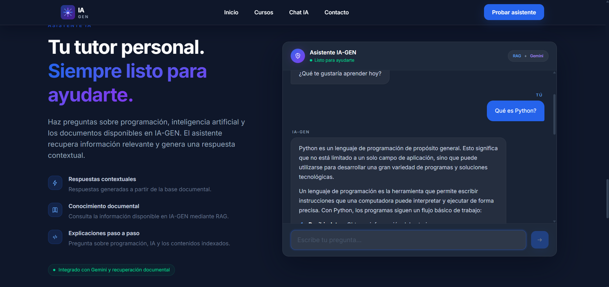

# IA-GEN

> **“La IA no llegó a reemplazarte, sino a ayudarte a crear lo imposible.”**

IA-GEN es una plataforma educativa Full Stack impulsada por Inteligencia Artificial.

Su objetivo es enseñar programación, Inteligencia Artificial generativa y tecnologías cloud mediante experiencias prácticas, contenido especializado y un asistente inteligente capaz de consultar información mediante un sistema RAG.

La aplicación integra un frontend moderno, una API REST, Google Gemini, ChromaDB, Docker y despliegue público en producción.

---

## Aplicación en producción

| Servicio         | Dirección                          |
| ---------------- | ---------------------------------- |
| Aplicación web   | https://ia-gen-frontend.vercel.app |
| API Backend      | https://ia-gen.onrender.com        |
| Estado de la API | https://ia-gen.onrender.com/health |

El backend utiliza el plan gratuito de Render. El primer acceso puede tardar algunos segundos mientras el servicio se activa.

---

## Captura de la aplicación

La siguiente captura muestra IA-GEN ejecutándose públicamente en producción y generando una respuesta mediante el asistente conectado con Google Gemini y el sistema RAG.

<p align="center">
  <a href="https://ia-gen-frontend.vercel.app" target="_blank">
    
  </a>
</p>

<p align="center">
  <a href="https://ia-gen-frontend.vercel.app">
    Abrir la aplicación IA-GEN
  </a>
</p>

---

## Estado del proyecto

**Versión actual:** `v0.7.0-dev`

**Estado:** Desarrollo activo con despliegue inicial en producción.

### Funcionalidades implementadas

- Frontend desarrollado con Next.js.
- Backend REST desarrollado con FastAPI.
- Chatbot conectado con Google Gemini.
- Sistema RAG con ChromaDB.
- Recuperación de información desde documentos.
- Historial de conversación.
- Integración completa entre frontend y backend.
- Ingestión automática de documentos.
- Base vectorial incluida en la imagen del backend.
- Contenedores Docker.
- Orquestación mediante Docker Compose.
- Pruebas automatizadas del backend.
- Configuración mediante variables de entorno.
- Despliegue del frontend en Vercel.
- Despliegue del backend en Render.
- Configuración CORS para desarrollo y producción.

### Próximas etapas

- Persistencia con PostgreSQL.
- Autenticación y autorización.
- Panel del estudiante.
- Gestión dinámica de cursos.
- Administración de usuarios.
- Observabilidad y alertas.
- Automatización CI/CD.
- Evolución de la infraestructura cloud.

---

## Arquitectura general

```text
┌──────────────────────────────┐
│      Usuario / Navegador     │
└──────────────┬───────────────┘
               │ HTTPS
               ▼
┌──────────────────────────────┐
│       Frontend Next.js       │
│      Desplegado en Vercel    │
└──────────────┬───────────────┘
               │ REST / JSON
               ▼
┌──────────────────────────────┐
│       Backend FastAPI        │
│      Desplegado en Render    │
├──────────────────────────────┤
│ Chat │ RAG │ Documentos      │
└──────────────┬───────────────┘
               │
       ┌───────┴────────┐
       ▼                ▼
┌──────────────┐  ┌──────────────┐
│  Gemini API  │  │   ChromaDB   │
│  Generación  │  │ Base vectorial│
└──────────────┘  └──────────────┘
```

### Flujo de una consulta

1. El usuario escribe una pregunta desde el frontend.
2. Next.js envía la solicitud al backend.
3. FastAPI valida el mensaje y el historial.
4. El sistema consulta ChromaDB.
5. Se recuperan los fragmentos más relevantes.
6. El contexto se envía a Gemini.
7. Gemini genera una respuesta fundamentada.
8. El backend devuelve la respuesta al frontend.

---

## Tecnologías

### Frontend

- Next.js.
- React.
- TypeScript.
- CSS.
- Fetch API.
- Vercel.

### Backend

- Python 3.12.
- FastAPI.
- Uvicorn.
- Pydantic.
- Google Gemini.
- ChromaDB.
- Pytest.
- Render.

### Infraestructura

- Docker.
- Docker Compose.
- Git.
- GitHub.
- Vercel.
- Render.

---

## Estructura del proyecto

```text
IA-GEN/
├── backend/
│   ├── app/
│   ├── data/
│   │   ├── documentos/
│   │   └── vector_db/
│   ├── tests/
│   ├── .env.example
│   ├── Dockerfile
│   ├── requirements.txt
│   └── requirements.lock
├── frontend/
│   ├── app/
│   ├── components/
│   ├── lib/
│   ├── public/
│   ├── package.json
│   └── README.md
├── Docs/
│   ├── ARCHITECTURE.md
│   ├── DECISIONS.md
│   ├── MASTER_PLAN.md
│   ├── PROJECT_VISION.md
│   └── ROADMAP.md
├── compose.yaml
├── LICENSE
└── README.md
```

---

## Requisitos

Para ejecutar el proyecto localmente necesitas:

- Git.
- Docker Desktop.
- Docker Compose.
- Una clave válida de Google Gemini.

Para ejecutar cada servicio manualmente también necesitas:

- Python 3.12.
- Node.js.
- npm.

---

## Ejecución local con Docker

### 1. Clonar el repositorio

```bash
git clone https://github.com/Angelhpr/IA-GEN.git
cd IA-GEN/IA-GEN
```

### 2. Configurar el backend

Copia el archivo de ejemplo:

```bash
cp backend/.env.example backend/.env
```

En PowerShell:

```powershell
Copy-Item backend/.env.example backend/.env
```

Edita `backend/.env` y configura como mínimo:

```env
GEMINI_API_KEY=TU_CLAVE_DE_GEMINI
CORS_ORIGINS=http://localhost:3000
```

No publiques el archivo `.env` ni claves privadas en Git.

### 3. Configurar el frontend

Crea el archivo:

```text
frontend/.env.local
```

Contenido:

```env
NEXT_PUBLIC_API_URL=http://localhost:8000
```

### 4. Iniciar los servicios

Desde la raíz del proyecto:

```bash
docker compose up --build
```

### Servicios locales

| Servicio     | Dirección                    |
| ------------ | ---------------------------- |
| Frontend     | http://localhost:3000        |
| Backend      | http://localhost:8000        |
| Health check | http://localhost:8000/health |

### Detener los servicios

```bash
docker compose down
```

---

## Ejecución manual

### Backend

Accede al directorio:

```bash
cd backend
```

Crea un entorno virtual:

```bash
python -m venv .venv
```

Actívalo en PowerShell:

```powershell
.\.venv\Scripts\Activate.ps1
```

Instala las dependencias:

```bash
pip install -r requirements.txt
```

Inicia el servidor:

```bash
uvicorn app.main:app --reload --host 0.0.0.0 --port 8000
```

### Frontend

En otra terminal:

```bash
cd frontend
npm install
npm run dev
```

---

## Variables de entorno

### Backend

| Variable                 | Descripción                                |
| ------------------------ | ------------------------------------------ |
| `APP_NAME`               | Nombre de la API.                          |
| `APP_VERSION`            | Versión actual del backend.                |
| `GEMINI_API_KEY`         | Clave privada para consumir Gemini.        |
| `MODEL_NAME`             | Modelo principal de Gemini.                |
| `FALLBACK_MODEL_NAME`    | Modelo alternativo.                        |
| `DEBUG`                  | Activa o desactiva el modo de depuración.  |
| `LOG_LEVEL`              | Nivel de registro de la aplicación.        |
| `CORS_ORIGINS`           | Lista de orígenes permitidos.              |
| `VECTOR_DB_PATH`         | Ruta de la base vectorial.                 |
| `INGESTION_ENABLED`      | Habilita la ingestión manual.              |
| `INGESTION_API_KEY`      | Protege el endpoint de ingestión.          |
| `INGESTION_SOURCE_PATH`  | Ruta de los documentos fuente.             |
| `AUTO_INGEST_ON_STARTUP` | Ejecuta la ingestión al iniciar.           |
| `DATABASE_URL`           | Conexión futura con PostgreSQL.            |
| `SECRET_KEY`             | Clave privada para funciones de seguridad. |

Ejemplo de CORS para desarrollo y producción:

```env
CORS_ORIGINS=http://localhost:3000,https://ia-gen-frontend.vercel.app
```

### Frontend

| Variable              | Descripción                    |
| --------------------- | ------------------------------ |
| `NEXT_PUBLIC_API_URL` | Dirección pública del backend. |

Producción:

```env
NEXT_PUBLIC_API_URL=https://ia-gen.onrender.com
```

---

## API REST

### Estado del servicio

```http
GET /health
```

Ejemplo de respuesta:

```json
{
  "status": "ok"
}
```

### Enviar un mensaje

```http
POST /api/chat
Content-Type: application/json
```

Ejemplo:

```json
{
  "message": "¿Qué es la inteligencia artificial generativa?",
  "history": []
}
```

El historial permite conservar el contexto reciente de la conversación.

### Consultar documentos

```http
GET /api/documents
```

### Consultar un documento específico

```http
GET /api/documents/{filename}
```

### Ingestar documentos

```http
POST /api/ingest
```

El endpoint de ingestión permanece deshabilitado por defecto y debe protegerse mediante configuración antes de habilitarse en un entorno público.

---

## Sistema RAG

IA-GEN utiliza recuperación aumentada por generación, conocida como RAG, para responder utilizando información procedente de los documentos del proyecto.

### Proceso

1. Los documentos se dividen en fragmentos.
2. Los fragmentos se convierten en representaciones vectoriales.
3. ChromaDB almacena esas representaciones.
4. La pregunta del usuario se transforma en una consulta vectorial.
5. Se recuperan los fragmentos más relevantes.
6. Gemini recibe la pregunta junto con el contexto recuperado.
7. Se genera una respuesta basada en la información disponible.

La imagen Docker del backend incluye una semilla de la base vectorial para que el sistema RAG pueda funcionar desde el inicio del despliegue.

---

## Pruebas y validaciones

### Backend

```bash
cd backend
python -m pytest
```

### Frontend

```bash
cd frontend
npm run lint
npm run build
```

### Docker Compose

Validar la configuración:

```bash
docker compose config
```

Construir las imágenes:

```bash
docker compose build
```

---

## Despliegue

### Frontend en Vercel

Configuración principal:

- Directorio raíz: `frontend`.
- Framework: Next.js.
- Variable de entorno:

```env
NEXT_PUBLIC_API_URL=https://ia-gen.onrender.com
```

### Backend en Render

Configuración principal:

- Directorio raíz: `backend`.
- Entorno basado en Docker.
- Puerto interno: `8000`.
- Health check: `/health`.
- Variables privadas configuradas desde Render.
- CORS habilitado para localhost y Vercel.

Las claves privadas nunca deben almacenarse directamente dentro del repositorio.

---

## Seguridad

- No incluir claves API en Git.
- No publicar archivos `.env`.
- Mantener restringidos los orígenes CORS.
- Deshabilitar la ingestión pública por defecto.
- Proteger los endpoints administrativos.
- Validar todas las entradas recibidas por la API.
- Ejecutar los contenedores con usuarios sin privilegios.
- Mantener actualizadas las dependencias.
- Utilizar HTTPS en producción.

---

## Documentación

- [Visión del proyecto](IA-GEN/Docs/PROJECT_VISION.md)
- [Roadmap de desarrollo](IA-GEN/Docs/ROADMAP.md)
- [Arquitectura](IA-GEN/Docs/ARCHITECTURE.md)
- [Plan maestro](IA-GEN/Docs/MASTER_PLAN.md)
- [Decisiones técnicas](IA-GEN/Docs/DECISIONS.md)

---

## Roadmap resumido

### Completado

- Base del backend.
- Integración con Gemini.
- Sistema RAG.
- ChromaDB.
- API REST.
- Frontend.
- Integración frontend y backend.
- Docker.
- Docker Compose.
- Producción inicial en Vercel y Render.

### En desarrollo futuro

- PostgreSQL.
- Autenticación.
- Panel del estudiante.
- Cursos dinámicos.
- Administración.
- Observabilidad.
- CI/CD.
- Evolución de infraestructura cloud.

## Ejemplos de preguntas que el agente puede responder

El agente puede responder consultas relacionadas con el contenido almacenado en la base vectorial, por ejemplo:

- ¿Qué es IA-GEN y cuál es su objetivo?
- ¿Cuál es la misión de IA-GEN?
- ¿Qué tecnologías utiliza la plataforma?
- ¿Cómo funciona el sistema RAG?
- ¿Qué valores promueve IA-GEN?
- ¿Qué diferencia existe entre IA-GEN y una plataforma educativa tradicional?
- ¿Cuáles son las próximas etapas del proyecto?
- ¿Cómo ayuda la Inteligencia Artificial al aprendizaje?

Las respuestas dependen del contexto recuperado desde ChromaDB y pueden variar ligeramente según la pregunta y el historial de conversación.

---

## Ejemplos de respuestas generadas por el agente

### Ejemplo 1

**Pregunta:**

> ¿Qué es IA-GEN?

**Respuesta generada:**

> IA-GEN es una plataforma educativa impulsada por Inteligencia Artificial que busca enseñar programación, IA generativa y tecnologías cloud mediante proyectos y experiencias prácticas. Su propósito es ayudar a estudiantes y profesionales a desarrollar habilidades aplicables al mundo real.

### Ejemplo 2

**Pregunta:**

> ¿Cuál es la misión de IA-GEN?

**Respuesta generada:**

> La misión de IA-GEN es formar a estudiantes y profesionales mediante una plataforma moderna en la que puedan aprender Inteligencia Artificial, programación y tecnologías cloud mientras construyen proyectos reales y fortalecen su portafolio profesional.

### Ejemplo 3

**Pregunta:**

> ¿Qué tecnologías utiliza IA-GEN?

**Respuesta generada:**

> IA-GEN utiliza Next.js y React para el frontend, FastAPI y Python para el backend, Gemini como modelo de Inteligencia Artificial y ChromaDB como base de datos vectorial. También utiliza Docker, Docker Compose, Vercel, Render, Git y GitHub.

### Ejemplo 4

**Pregunta:**

> ¿Cómo funciona el sistema RAG?

**Respuesta generada:**

> El sistema RAG busca en ChromaDB los fragmentos de documentos más relacionados con la pregunta del usuario. Después, envía ese contexto junto con la consulta a Gemini, permitiendo generar una respuesta basada en la documentación disponible y no únicamente en el conocimiento general del modelo.

### Ejemplo 5

**Pregunta:**

> ¿La Inteligencia Artificial busca reemplazar a las personas?

**Respuesta generada:**

> La filosofía de IA-GEN establece que la Inteligencia Artificial no sustituye el talento humano. Su función es potenciar la creatividad, acelerar el aprendizaje y ayudar a las personas a desarrollar soluciones que antes parecían difíciles o imposibles.

---

## Licencia

Este proyecto se distribuye bajo los términos definidos en el archivo [LICENSE](IA-GEN/LICENSE).

---

Desarrollado con Next.js, FastAPI, Gemini, ChromaDB, Docker, Vercel y Render.
